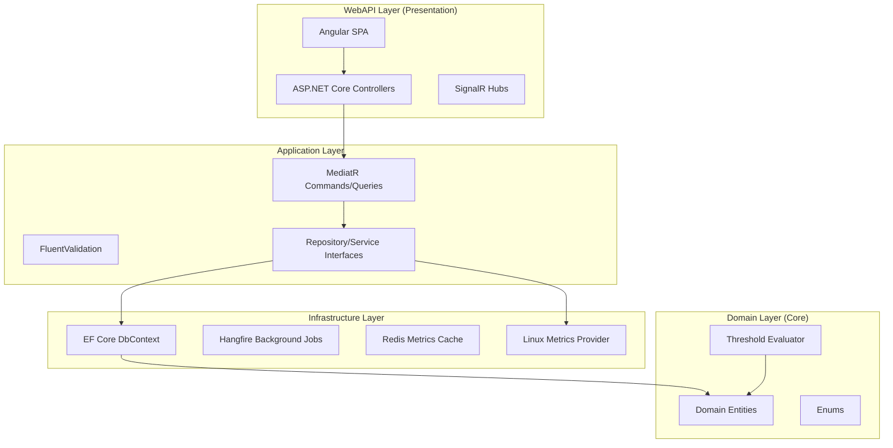
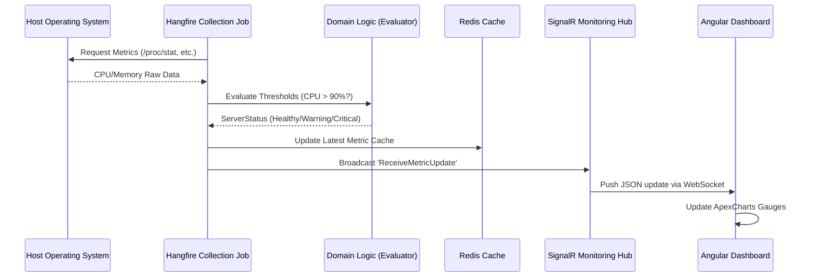
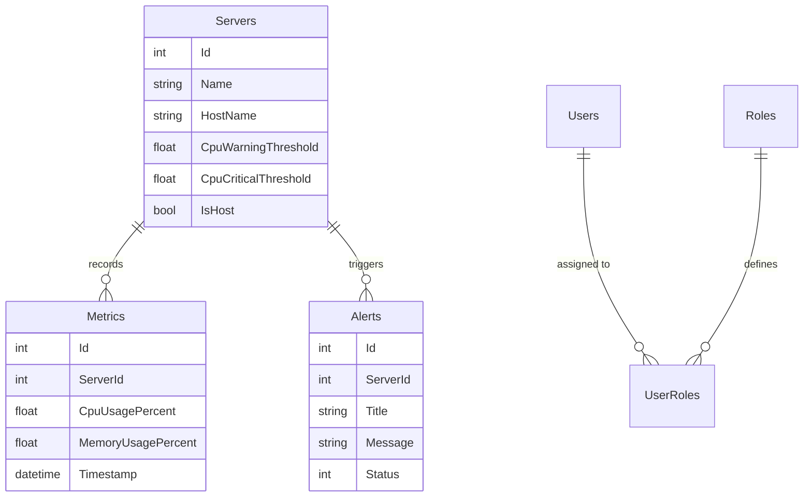

# Architecture Documentation

## Overview
This system is architected using **Clean Architecture** (Onion Architecture) principles. The primary goal is to maintain a strict separation between business logic and infra-structural concerns (UI, Database, External Services). This ensures the application is highly testable, maintainable, and adaptable to future technology changes.

---

## 🏛️ Architectural Diagrams

### 1. System Components & Layering
The following diagram illustrates the dependency flow between layers. All dependencies point inward toward the Domain layer.

### 2. Sequence Diagram: Real-Time Metric Flow
This diagram shows how a hardware metric is collected from the OS, processed by business logic, and pushed live to the browser.

### 3. Database Schema (ERD)
The schema is designed to handle high-frequency time-series data (metrics) and real-time state management.

---

## 🏛️ System Layers Detail

### 1. Domain Layer (`app/src/Domain/`)
The center of the architecture. It contains pure business models and logic.
- **Entities**: `Server.cs`, `Metric.cs`, `Alert.cs`, `User.cs`.
- **Logic Example**: `ThresholdEvaluator` - Encapsulates the logic for when a server status should change from "Healthy" to "Warning" based on CPU/Memory/Disk usage.
- **Enums**: `ServerStatus` (Healthy, Warning, Critical, Offline).

### 2. Application Layer (`app/src/Application/`)
Handles the orchestration of the system. It implements the **CQRS** pattern using **MediatR**.
- **Commands**: `CreateServerCommand.cs`, `ResolveAlertCommand.cs`.
- **Queries**: `GetServersQuery.cs`, `GetLatestMetricsQuery.cs`.
- **Validation**: `CreateServerCommandValidator.cs` - Uses FluentValidation to ensure server names are unique and thresholds are valid (0-100%).
- **Interfaces**: `IApplicationDbContext.cs`, `ICacheService.cs`.

### 3. Infrastructure Layer (`app/src/Infrastructure/`)
Technical implementations of the abstractions defined in the inner layers.
- **Persistence**: `ApplicationDbContext.cs` - EF Core implementation for SQL Server.
- **Caching**: `RedisCacheService.cs` - Handles high-speed storage for SignalR and dashboard metrics.
- **Background Jobs**: `CollectMetricsJob.cs` - Enqueued by Hangfire to run every 5 minutes.
- **Metrics Provider**: `LinuxMetricsProvider.cs` - Directly reads systems files like `/proc/stat` and `/proc/meminfo`.

### 4. Presentation Layer (`app/src/WebAPI/`)
The interface for external clients.
- **Controllers**: `ServersController.cs`, `AlertsController.cs`.
- **Real-Time Hubs**: `MonitoringHub.cs` - Manages SignalR connections and group memberships (e.g., joining a specific server dashboard).
- **Security**: JWT-based middleware and `Authorize` attributes for Role-Based Access Control (Admin/User).

---

## 📐 Design Patterns & SOLID Principles

### SOLID Principles Applied
1. **Single Responsibility (SRP)**: Each MediatR handler does exactly one thing (e.g., `DeleteServerCommandHandler` only handles server removal).
2. **Open/Closed (OCP)**: New Metric Providers (e.g., `WindowsMetricsProvider`) can be added without modifying the existing `CollectMetricsJob`.
3. **Dependency Inversion (DIP)**: The API layer depends on the `IMediator` interface, not on concrete handler implementations.

### Design Patterns
- **Repository Pattern**: Abstracts database access to make the application layer testable without a real database.
- **Singleton Pattern**: Applied to metric collectors to maintain CPU/Network sampling deltas across requests.
- **CQRS**: Separates read models (Queries) from write models (Commands) for better performance and scalability.

---

## 🔄 Lifecycle Example: Handling a Metric Breach
1. **Infrastructure**: `Hangfire` starts the `MetricCollectionJob`.
2. **Application**: The job calls `IMetricsProvider.GetLatestMetricsAsync()`.
3. **Domain**: The returned metric is passed to `ThresholdEvaluator.DetermineStatus()`.
4. **Application**: Logic sees a status change to `Critical`.
5. **Infrastructure**: A new `Alert` is saved to SQL Server via EF Core.
6. **Infrastructure**: The metric is also saved to **Redis** for the "Latest" view.
7. **WebAPI**: `MonitoringHub` pushes the new `Alert` and `Metric` to all browser clients.
8. **Frontend**: The Angular dashboard plays an alert sound and highlights the server in Red.

---

## 🚀 Technology Stack Justification
- **.NET 10.0**: Used for its extreme performance in I/O bound monitoring scenarios.
- **Redis**: Essential for SignalR scaling and as a high-speed buffer for late-arrival metrics.
- **Angular 20**: Provides the structural integrity needed for a complex real-time dashboard.
- **Hangfire**: Chosen over standard Hosted Services to ensure job persistence and retrial across container restarts.
